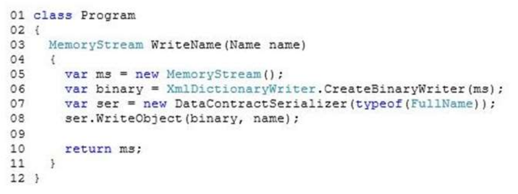

------

# QUESTION 135

### PREGUNTA TEORICA

------

You are troubleshooting an application that uses a class named FullName. The class is decorated with the
DataContractAttribute attribute. The application includes the following code. (Line numbers are included for reference only.)

You need to ensure that the entire FullName object is serialized to the memory stream object.
Which code segment should you insert at line 09?

A. binary.WriteEndDocument();
B. binary.WriteEndDocumentAsync();
C. binary.WriteEndElementAsync();
D. binary.Flush();
E. binary.WriteEndElement();
F. ms.Close();
G. ms.Flush();

------

### RESPUESTA

Revisando la teoría: 

* WriteEndDocument: no aparece en  el MOC. Buscando en la web, se usa en caso de generar XML escribiendo etiquetas: https://docs.microsoft.com/en-us/dotnet/api/system.xml.xmlwriter.writeenddocument?view=net-5.0
* WriteEndDocumentAsync, WriteEndElementAsync, WriteEndElement: similares al anterior.
* Flush sí se indica en el MOC que se usa para cerrar streams. 
* ms.close() y ms.flush() : esto  lo hará la programación cuando utilice los datos retornados.

Correct Answer: D
Section: Volume B
Explanation/Reference:
Flush() flushes whatever is in the buffer to the underlying streams and also flushes the underlying stream.
We should flush the binary stream with the binary.Flush() command.

Example:
By default, the DataContractSerializer encodes objects into a stream using a textual representation of XML.
However, you can influence the encoding of the XML by passing in a different writer. The sample creates a
binary writer by calling CreateBinaryWriter. It then passes the writer and the record object to the serializer when it calls WriteObjectContent. Finally, the sample flushes the writer.

MemoryStream stream2 = new MemoryStream();
XmlDictionaryWriter binaryDictionaryWriter = XmlDictionaryWriter.CreateBinaryWriter(stream2);
serializer.WriteObject(binaryDictionaryWriter, record1);
binaryDictionaryWriter.Flush();

References:
https://docs.microsoft.com/en-us/dotnet/api/system.xml.xmldictionarywriter
https://docs.microsoft.com/en-us/dotnet/framework/wcf/samples/datacontractserializer-sample

