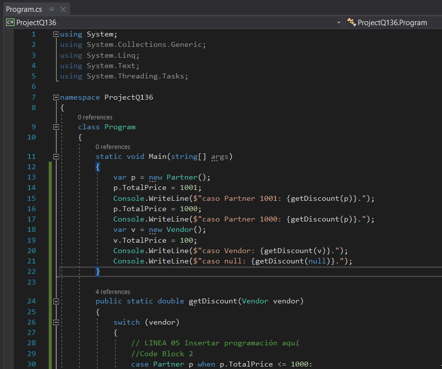
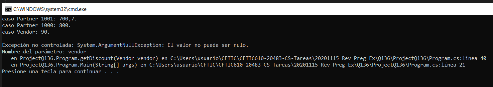

------

# QUESTION 136

------

You have the following C# code.

```c#
public class Vendor
{
	public double TotalPrice  { get; set; }
}
public class Partner : Vendor{}
```

You create a function named **getDiscount** that has the following method signature.

```c#
public static double getDiscount(Vendor vendor) 
{
    switch(vendor)
    {
    	// LINEA 05 Insertar programación aquí
    }
}
```

You need to modify **getDiscount** to return the amount of the discount. The solution must meet the following requirements:

* If the *vendor* object is a type of Partner object and TotalPrice is greater than 1,000, the discount must be 30 percent. 
* If the *vendor* object is a type of Partner object and TotalPrice is less than or equal to 1,000, the discount must be 20 percent.
* If the *vendor* object is NOT a type of Partner object, the discount must be 10 percent.
* If the *vendor* object is null, an exception must be raised.

Which four code blocks should you use to complete the switch statement at line 05? Arrange them in the correct order. NOTE: Each correct selection is worth one point.

Code blocks: 

```c#
//Code Block 1
case Partner p:
	return p.TotalPrice * 0.70;
```


```c#
//Code Block 2
case Partner p when p.TotalPrice <= 1000:
	return p.TotalPrice * 0.80;
```

```c#
//Code Block 3
case null:
	throw new ArgumentNullException(nameof (vendor));
```

```c#
//Code Block 4
case Vendor v when vendor.TotalPrice <= 1000:
	return v.TotalPrice * 0.80;
```

```c#
//Code Block 5
case Partner p when p.TotalPrice > 1000:
	return p.TotalPrice * 0.80;
```

```c#
//Code Block 6
case Partner p when p is null:
	throw new ArgumentNullException(nameof (p));
```

```c#
//Code Block 7
case Vendor v:
	return v.TotalPrice * 0.90;
```


------

### RESPUESTA

Correct Answer:

```c#
//Code Block 2
case Partner p when p.TotalPrice <= 1000:
	return p.TotalPrice * 0.80;
```

```c#
//Code Block 1
case Partner p:
	return p.TotalPrice * 0.70;
```

```c#
//Code Block 7
case Vendor v:
	return v.TotalPrice * 0.90;
```

```c#
//Code Block 3
case null:
	throw new ArgumentNullException(nameof (vendor));
```


Section: Volume B
Explanation/Reference: 

* References:
https://docs.microsoft.com/en-us/dotnet/csharp/pattern-matching#when-clauses-in-case-expression
* 

------

### PROGRAMACIÓN DE COMPROBACIÓN

Ejecutar ProjectQ136, y se comprueba que con la solución del PDF:



... la salida es la pedida:

