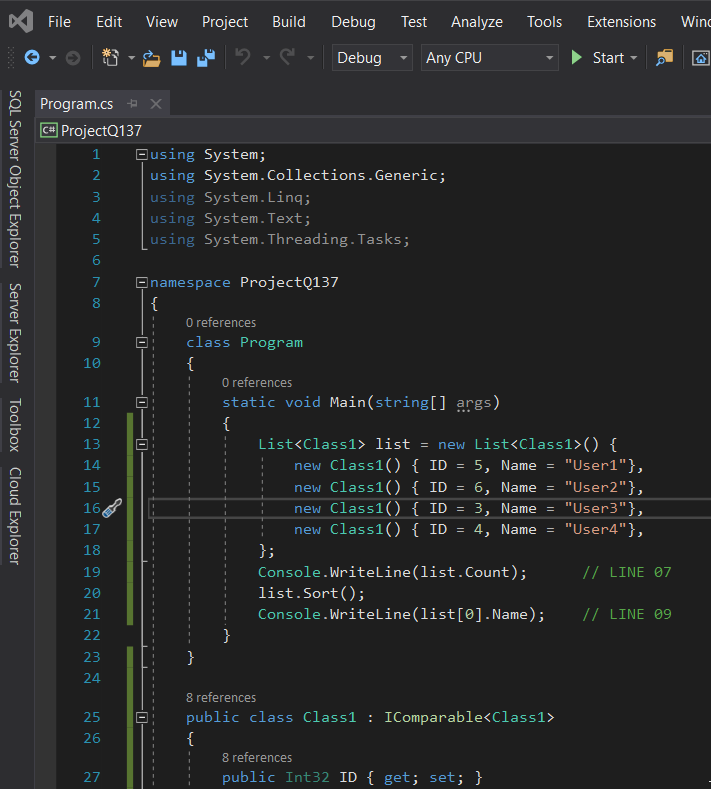
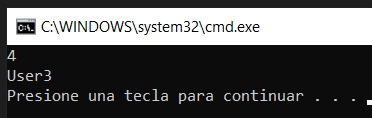

------

# QUESTION 137

------

You define a class by using the following code.

```c#
public class Class1 : IComparable<Class1>
{
	public Int32 ID { get; set; }
   	public String Name { get; set; }
    public int CompareTo(Class1 other)  
    { 
        if (ID == other.ID) return 0;
        else return ID.CompareTo(other.ID);
    }
}
```

You write the following code for a method:

```c#
List<Class1> list = new List<Class1>() {
    new Class1() { ID = 5, Name = "User1"},
    new Class1() { ID = 6, Name = "User2"},
    new Class1() { ID = 3, Name = "User3"},
    new Class1() { ID = 4, Name = "User4"},
};
Console.WriteLine(list.Count);		// LINE 07
list.Sort();
Console.WriteLine(list[0].Name);	// LINE 09
```

Select the answer choice that completes each statement based on the information presented in the code.
NOTE: Each correct selection is worth one point.

* Line 07 of the method will display...  0  /  1  /   2  /  3  /  4
* Line 09 of the method will display...  User1  /  User2  /  User3  /  User4


------

### RESPUESTA

A simple vista, la clase *Class1* implementa la interfaz *IComparable*<Class1> que permite comparar contro Class1, por ejemplo de cara a ordenar una lista. *CompareTo* devuelve 0 para iguales y si son diferentes la comparación de *Int32*, que lleva a ordenar de manera creciente.


Correct Answer:

* Line 07 of the method will display...  4
* Line 09 of the method will display...  User3  

Section: Volume B
Explanation/Reference:  SIN EXPLICACIONES EN EL PDF


------

### PROGRAMACIÓN DE COMPROBACIÓN

Ejecutar ProjectQ137, y se comprueba la solución del PDF:



... la salida es:

