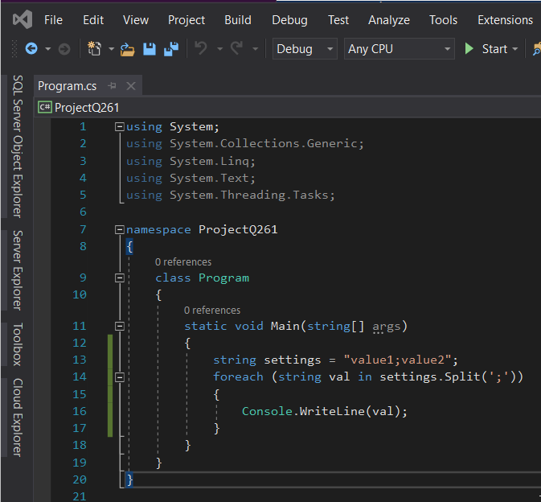
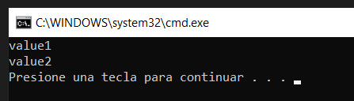

------

# QUESTION 261

------

You need to write code that will display value1, and then value2 in the console.

You write the following code:

```c#
string settings = "value1;value2";
foreach( TARGET1 val TARGET2 settings. TARGET3 (TARGET4) )
{
    Console.WriteLine(val);
}
```

How should you complete the code? Each code element may be used once, more than once, or not at all. NOTE: Each correct selection is worth one point.

Code Segments:  (EN CADA TARGET PONER UNO DE ESTOS)

```c#
";"
```

```c#
':'
```

```c#
current
```

```c#
in
```

```c#
Intersect
```

```c#
Split
```

```c#
string
```


------

### RESPUESTA

Es una típica programación, que se usa en muchos lenguajes, que consiste en trocear un string mediante Split y tratar cada elemento con foreach.

Correct Answer:

```c#
string
```

```c#
in
```

```c#
Split
```

```c#
";"
```


Section: Volume B
Explanation/Reference:  SIN EXPLICACIONES EN EL PDF


------

### PROGRAMACIÓN DE COMPROBACIÓN

Para que la solución compilara, hubo que cambiar ";" por ';'.

Ejecutar ProjectQ261, y se comprueba la solución del PDF:



... la salida es:

